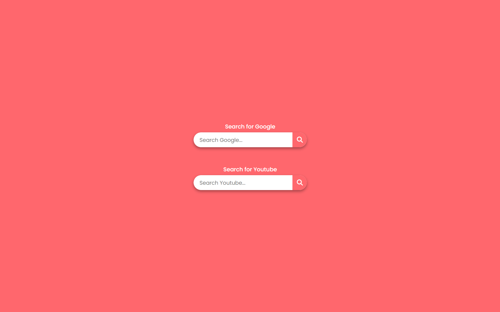

# Search Button Project 🔍

 <!-- Replace with your actual image path -->

## Project Description

This project features interactive search buttons that allow users to search Google and YouTube without the need for JavaScript. The design is sleek and user-friendly, making searching more engaging.

### Features

- **Google Search**: Quickly search for anything on Google.
- **YouTube Search**: Seamlessly search for videos on YouTube.
- **Responsive Design**: The layout adjusts beautifully to different screen sizes.
- **No JavaScript Required**: All functionality is achieved using HTML and CSS.

### How It Works 💡

- Each search box uses a checkbox to control the visibility of the input field.
- The search forms direct the user to the respective search engines when submitted.

### Tech Stack

- **HTML**: For structuring the content.
- **CSS**: For styling and animations.

### Getting Started 🚀

To run the project locally:

1. Clone the repository:
   ```bash
   https://github.com/arjunmalpani/SearchYoutubeGoogle.git
